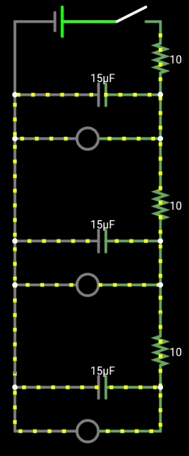

# Reolution-Hardware-Week-1

This project is a simple circuit that turns on three LEDs one after another with a 1 second delay between each LED.

[Live Demo](https://falstad.com/circuit/circuitjs.html?ctz=CQAgjCAMB0l3BWKsDsAWFkwoXAzGJGngExK4hLGUCmAtGGAFABOIeeAbCAByTtdwnfv0JMAziBIoSvfh258oygGYBDADbiaTAMYDuYYVMg8h-NMnhYkJaIyw8UhAJxgXpsGYYimAN3AURX5pWSUREDR+JAiYBCYAd0Dg5PA0S0hEkzMjUSDzKCzsQ2NitIymI1kFbNSSUykQABMadQBXDQAXOg0aJvBlEVhmJJrcg1rMpLL6nPzxqYnZpajC6fzlmdXFsq457ijfUcE9icO11NPd+oua0nkTzjNMqomr-NPZFvaunr6B2LDIofG67IgXZb3S43TL6O43SE3DKweBgJBgaA8dIkPBoMDSFx4ZzpSw+QpsGokVbwiJidbcBAkfaRcJZGpoJQ1RnPSqcaqCbmpQVfVpqDrdXr9CCArDAg5KMpoTgVJLLDl5eW+OGCdW1XXI6xo8DQIJ4BCcGRM0gkQnmkBkzIUnVwM7hcA7D7grZHVJKyyKl2ZAD2jWVyiiLhclGQGUa1SYIf4YYskEj0Zg-sa8iYeDMsgAYtKrIbi1gsPaIABhNQABzUugAlp01AA7XQ6XPKQvKCCECAMEAAJRo4gb4mbbZ0QA)

The circuit uses RC timing. Each capacitor takes more time to charge because of another resistor, which delays the next LED from turning on.
